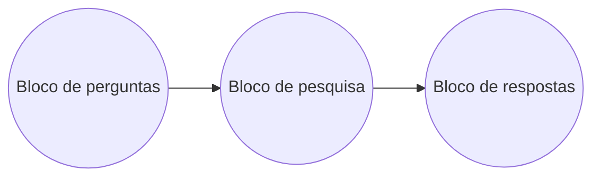
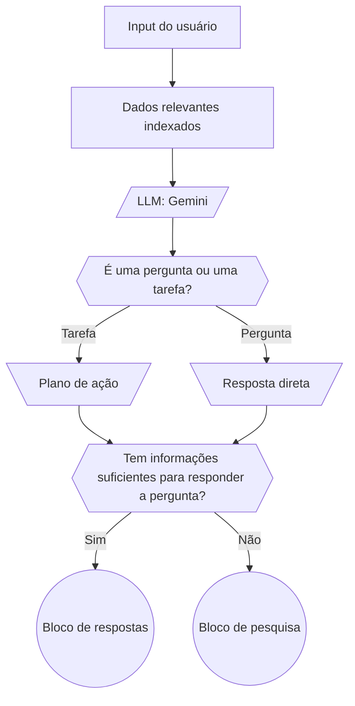
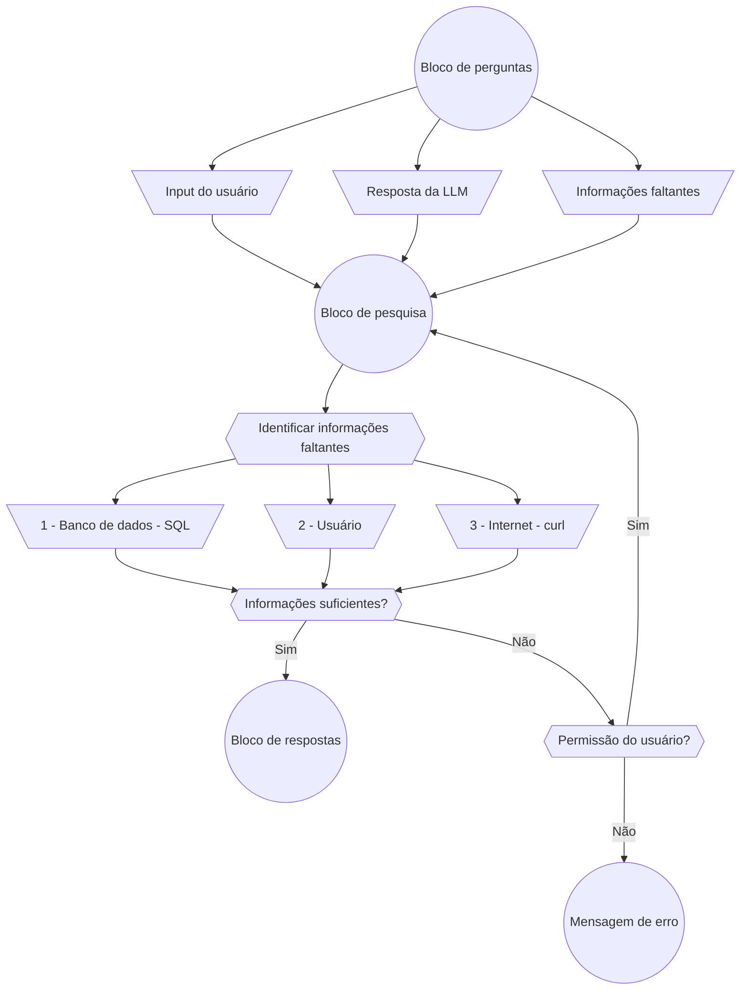
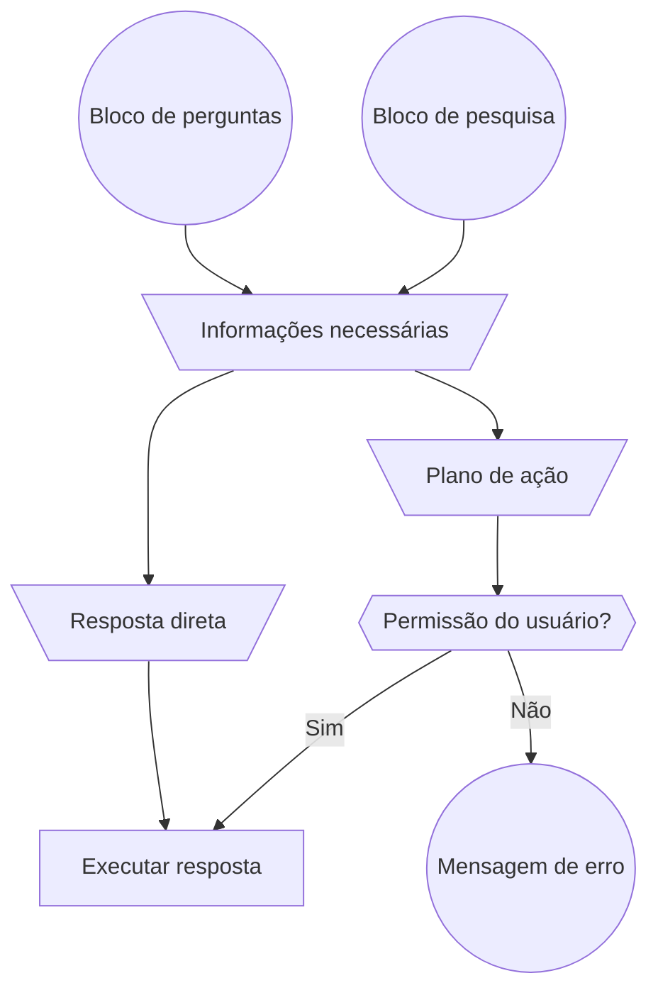

# Planejamento

https://lokito.notion.site/Multi-target-agent-24ed915b7f5180fe8c58e9a6c29b4fac?pvs=73

Meu objetivo é criar um agente capaz de interagir com o usuário para executar tarefas e responder dúvidas.

1. Executar comandos de bash com permissão do usuário;

2. Fornecer respostas com base nos documentos, banco de dados e da internet (através do curl);

3. Preciso conseguir me comunicar com ele pelo terminal e pelo navegador web.

## Fluxo de trabalho
Tenho um plano divido em 3 blocos principais:

1. **Bloco de perguntas**: Recebo a pergunta do usuário e faço a decisão de qual o próximo passo;
2. **Bloco de pesquisa**: Onde busco as informações necessárias para responder a pergunta do usuário;
3. **Bloco de respostas**: Onde decido como responder a pergunta do usuário;

**Padronização**
Algumas informações são relevantes para multiplos prompts de LLM, por exemplo o que o `type: "task"` significa, ou o que é o `type: "aswer"`, o que é a string "DOCUMENTS" em `sources`, etc. Essas informações são padronizadas e guardadas em um arquivo separado, que é importado para os prompts de LLM.

Outra informação padronizada são as mensagens de erro, que são guardadas em um arquivo separado, que é importado para os prompts de LLM.

### Fluxograma

**Macro**
Esse é o macro da aplicação principal, onde cada bloco é um passo do fluxo de trabalho, terei tambem alguns processos secundários que não vão estar represetados aqui, porque não são executados durante o processo principal e não são essenciais mas são úteis no dia a dia.

**Bloco de perguntas**:
1. Recebo o inpuit do usuário;
2. Faço retreiver os dados relevantes indexados;
3. Envio a primeira pergunta para a LLM:
    1. É uma pergunta ou uma tarefa?
        - Se for uma tarefa, então peço para a LLM me retornar um plano de ação;
        - Se for uma pergunta, então peço para a LLM me retornar uma resposta direta;
    2. Tem informações suficientes para responder a pergunta?
        - Se sim, então a resposta da LLM já é a resposta final, já está formatada e pronta para ser enviada ao **Bloco de respostas**.
        - Se não, então a resposta da LLM é a informação de quais são as informações necessárias para responder a pergunta, e envio essa informação para o **Bloco de pesquisa**.

**Bloco de pesquisa**:
1. Recebo input inicial do **Bloco de perguntas**:
    - Sei que a resposta inicial não é o suficiente para responder a pergunta do usuário, mas esta descrito quais são as informações faltantes através da resposta da LLM;
    - Sei qual foi a pergunta inicial do usuário, através do input inicial;
    - Sei se é uma pergunta ou uma tarefa, através da resposta da LLM;
2. Identificar onde conseguir as informações faltantes com base em uma ordem de prioridade:
    - Algumas ferramentas podem precisar de permissão do usuário para serem executadas.
    1. Banco de dados SQL [Coleta sem permissão]:
        - A informação bate com o metadado guardado daquela tabela do banco de dados;
    2. Perguntar ao usuário diretamente; 
        - A informação depende da opinião do usuário como nomes, senhas, configurações pessoais, etc;
    3. Internet (através do `curl`) [Coleta com permissão]:
        - Permissão do usuário para acessar a internet e buscar informações.

3. Tenho informações o suficiente para responder a pergunta?
    - Se sim, então envio as informações para o **Bloco de respostas**;
    - Se não, peço permissão ao usuário para buscar as informações faltantes novamente:
        - Se ele der permissão, então busco as informações faltantes então volto para o inicio do **Bloco de perguntas**;
        - Se ele não der permissão, então retorno uma **mensagem de erro** informando que não tenho informações suficientes para responder a pergunta.

1. Se cheguei aqui, então já tenho as informações necessárias para responder a pergunta do usuário;
2. Se for uma resposta direta, então envio a resposta diretamente ao usuário;
3. Se for uma tarefa, então peço permissão para o usuário executar o plano de ação:
    - Se ele der permissão, então executo o plano de ação;
    - Se ele não der permissão, então retorno uma **mensagem de erro** informando que não posso executar a tarefa sem permissão.

**Bloco de respostas**:
1. Se cheguei aqui, então já tenho as informações necessárias para responder a pergunta do usuário;
2. Se for uma resposta direta, então envio a resposta diretamente ao usuário;
3. Se for uma tarefa, então peço permissão para o usuário executar o plano de ação:
    - Se ele der permissão, então executo o plano de ação;
    - Se ele não der permissão, então retorno uma **mensagem de erro** informando que não posso executar a tarefa sem permissão.

## Observações
- Resolvi fazer 2 ferramentas para ajudar no processo de dia a dia, o primeiro é uma feramenta para fazer embedding de documentos e o segundo é uma ferramenta para buscar informações no banco de dados SQLite;

- Essas ferramentas são usadas durante o build e elas permitem facilitar o processo de tornar o programa agnostico a dados, ou seja, se quiser adicionar novos documentos ou novos dados no banco de dados, basta rodar essas ferramentas e elas vão atualizar os embeddings e o banco de dados automaticamente;

    - Por falta de tempo, o banco de dados ainda não é totalmente agnostico, ele tem a coleta de metadados (precisa de revisão porque a confiabilidade é baixa, depende de como o usuário nomeia as tabelas e colunas), mas ainda não criei a tool automaticamente, então preciso criar a tool manualmente para cada banco de dados que eu quiser usar;

## Mudanças
Acabei resolvendo implementar somente os 2 primeiros blocos, o terceiro bloco (Bloco de respostas), ele não é exatamente mais complexo, mas depende de interação humana que é demorada de fazer e gera muitos bugs, então acabei deixando para uma próxima versão.

Optei por fazer um RAG com mais 'k e menos chunks', ou seja, ao invés de fazer uma busca com 5 chunks de 2000 tokens, eu faço uma busca com 20 chunks de 500 tokens, isso me permite ter mais informações relevantes e menos informações irrelevantes, mas aumenta o custo computacional e o tempo de resposta, mas como o projeto roda no computador local e não em um servidor onde o custo é alto, não vejo problema.

## Proximos passos
Perder um tempo a mais em cada uma das ferramentas, para melhorar a confiabilidade e a robustez do sistema, principalmente na parte de parsing das respostas da LLM, que é o ponto mais frágil do sistema.

- Perderia um tempo a mais trabalhando ferramenta de busca, atualmente ela consegue lidar "de certa forma" com buscas complexas, mas tem um certo limite do quão eficiente ela é porque não foi feita para isso, a ferramenta esta estupidamente simples.

- Tambem perderia um tempo maior construindo melhorando a ferramenta de busca SQL, para evitar multiplas consultas no banco quando precisa de uma unica busca complexa, para um deploy rápido, adicionei essa instrução no prompt e ela deve se manter, mas isso aumenta o custo computacional, custo de tempo de resposta e custo financeiro, já que cada chamada a LLM vai precisar validar se tem informações suficientes ou precisa buscar mais.

- Perderia um tempo tambem lidando com o fluxo de interação humana, acho que se fosse refazer o projeto removeria o subgraph e construiria o fluxo completamente no graph principal, na minha cabeça ficaria muito complexo manter tudo junto, não estou acostumado em usar o langgraph em projetos tão grandes e achei que ficaria mais complexo que a realidade na hora do planejamento.

- Acredito que os prompts podem ser melhorados, principalmente o prompt do bloco de perguntas, o selfAskWithSearch ficou bastante consistente, apesar de frequentemente retornar retornar outputs fora do padrão esperado, o que é um problema, mas acredito que seja mais por causa do modelo de linguagem do que do prompt em si.

- Adicionaria mais algumas ferramentas, para auxiliar no auxilio ao usuário, como uma ferramenta para listar os arquivos do diretório atual, pegar o conteúdo de um arquivo, verificar data e hora, etc. Essas ferramentas são úteis para o dia a dia e podem ser usadas em diversas situações.
    - Observei que seria útil, quando pedi para a LLM buscar a previsão do tempo para amanhã e ela buscou no google a previsão de amanhã e não com uma data específica, o google não conseguiu retornar a previsão mas retornou no contexto a data e o site da previsão.

- Talvez falte uma amplitude maior de testes automatizados, para garantir que o sistema esteja funcionando corretamente e que as ferramentas estejam sendo usadas corretamente. Atualmente, tenho alguns testes nas partes mais críticas do sistema, mas não em todas as ferramentas e fluxos de trabalho.