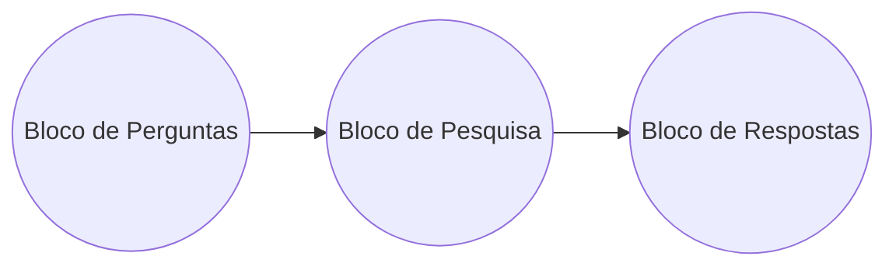

# Agente de IA Multi-Fonte

## Visão Geral

Este projeto é um agente de IA inteligente construído com Node.js, Bun e TypeScript, utilizando frameworks de LLM como LangChain.js e LangGraph. O agente é capaz de responder a perguntas e executar tarefas complexas, utilizando múltiplas fontes de dados, como bancos de dados SQLite, documentos de texto e conteúdo da web.

O objetivo é criar um assistente robusto que possa ser acessado via terminal, entender as necessidades do usuário, buscar informações de forma autônoma e executar ações com a devida permissão.

## Tecnologias Utilizadas

- **Runtime:** Bun
- **Linguagem:** TypeScript
- **Integração com LLM:** LangChain.js
- **Orquestração de Fluxo:** LangGraph.js
- **Modelo de Linguagem:** Google Gemini (Flash e Pro)
- **Banco de Vetores:** HNSWLib (via LangChain)

## Funcionalidades Principais

1.  **Respostas a partir de Múltiplas Fontes:**
    -   **Bancos de Dados SQLite:** O agente consulta arquivos `.db` localizados na pasta `data/sqlite`. Ele gera e utiliza metadados sobre os esquemas do banco de dados para construir consultas SQL de forma autônoma.
    -   **Contexto de Documentos:** Extrai informações de arquivos `.txt` e `.pdf` na pasta `data/documents`, utilizando um banco de dados vetorial para realizar buscas semânticas (RAG).
    -   **Dados Externos:** Executa comandos `curl` para buscar informações na web, sempre solicitando a aprovação do usuário.
    -   **Interação com o Usuário:** Pode fazer perguntas diretas ao usuário para obter informações que não podem ser encontradas em outras fontes (ex: nomes de arquivos, preferências, etc.).

2.  **Interface Conversacional:** A interação com o agente é feita através do terminal.

3.  **Roteamento Inteligente:** O agente decide qual a fonte de dados ou ferramenta mais apropriada para cada pergunta e orquestra o fluxo de trabalho para chegar à resposta final.

4.  **Execução de Tarefas:** Para solicitações que exigem múltiplos passos (ex: "crie um arquivo e escreva um resumo nele"), o agente monta um plano de ação e pede permissão ao usuário antes de executá-lo.

## Arquitetura

O fluxo de trabalho do agente é dividido em três blocos principais, orquestrados por um grafo de estados (StateGraph).



1.  **Bloco de Perguntas:** Recebe a entrada do usuário, busca informações relevantes em documentos vetorizados e decide se a solicitação é uma pergunta direta ou uma tarefa. Se a informação for suficiente, ele gera a resposta. Caso contrário, define quais informações estão faltando.

2.  **Bloco de Pesquisa:** Se informações adicionais forem necessárias, este bloco é ativado. Ele utiliza um sub-agente com um conjunto de ferramentas (`SQLite`, `Curl`, `Perguntar ao Usuário`) para buscar os dados faltantes de forma iterativa.

3.  **Bloco de Respostas:** Com todas as informações em mãos, este bloco formata a resposta final. Se for uma tarefa, ele apresenta o plano de execução e solicita a aprovação do usuário antes de agir.

## Como Executar

1.  **Clone o repositório:**
    ```bash
    git clone <url-do-repositorio>
    cd skip
    ```

2.  **Instale as dependências:**
    ```bash
    bun install
    ```

3.  **Configure as variáveis de ambiente:**
    -   Copie o arquivo de exemplo: `cp .env.example .env`
    -   Adicione sua chave da API do Google no arquivo `.env`:
        ```
        GOOGLE_API_KEY="SUA_CHAVE_API"
        ```

4.  **Adicione seus dados (Opcional):**
    -   Coloque arquivos de banco de dados SQLite (`.db`) na pasta `data/sqlite/`.
    -   Coloque arquivos de texto (`.txt`) ou PDFs (`.pdf`) na pasta `data/documents/`.

5.  **Inicie o agente:**
    ```bash
    bun run dev
    ```
    > **Nota:** Ao iniciar, o agente verificará se existem novos documentos ou bancos de dados que ainda não foram processados (geração de metadados/embeddings). Ele perguntará se você deseja processá-los.

## Como Testar

Você pode fazer perguntas que explorem as diferentes capacidades do agente.

1.  **Consulta ao Banco de Dados (usando `music.db`):**
    -   `"Quais os álbuns do artista 'Accept'?"`
    -   `"Liste os nomes dos funcionários que moram em Calgary."`

2.  **Consulta a Documentos (usando `economy_books.txt`):**
    -   `"Faça um resumo sobre o livro de economia."`
    -   `"Quais os principais tópicos abordados no documento sobre economia?"`

3.  **Comando Externo (Curl):**
    -   `"Qual a capital da França?"`
    -   `"Qual a previsão do tempo para São Paulo amanhã?"`

4.  **Execução de Tarefa:**
    -   `"Crie um arquivo chamado 'artistas.txt' e liste todos os nomes de artistas do banco de dados nele."`

## Recursos

-   [LangChain JS Documentation](https://js.langchain.com/docs/)
-   [LangGraph Documentation](https://js.langchain.com/docs/langgraph/)
-   [Google AI for Developers](https://ai.google.dev/)

## Licença

Este projeto está licenciado sob a Licença MIT - veja o arquivo [LICENSE](LICENSE) para mais detalhes.